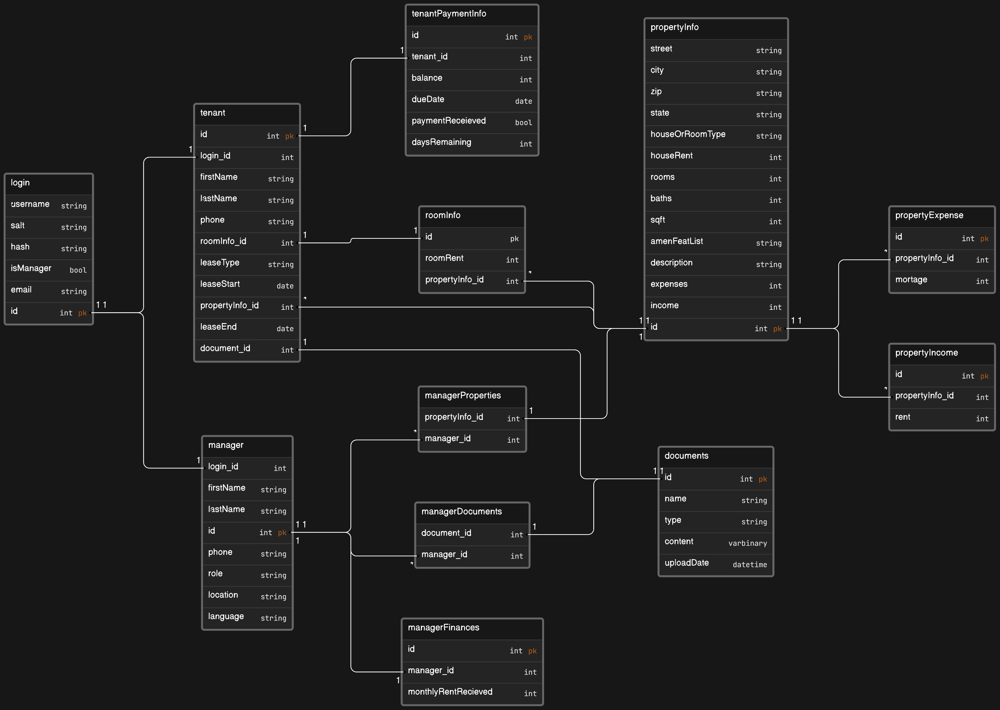

# PropTrac Backend

## API

**Details:** API is deployed on Azure: https://proptracapi.azurewebsites.net

> [!IMPORTANT]
> Please view the tables below for specific endpoints/ requests. 

<h4 align="center">Table 1: User Controller Endpoints</h4>

| Description | HTTP Method | Endpoint | Parameter Type (Body or URL) | Parameter Requirements |
| ------------- | ------------- | ------------- | ------------- | ------------- |
| Create an Account *(Manager or Tenant)*  | `POST`  | /User/AddUser  | Body | int ID, string Username, string Password, string Email, bool IsManager, string FirstName, string LastName |
| Login *(Manager or Tenant)* | `POST`  | /User/Login  | Body | string UsernameOrEmail, string Password |
| Update User | `PUT`  | /User/Update  | Body | .. |
| Delete User | `DELETE`  | /User/DeleteUser/{userToDelete}  | URL | .. |
| Update Username | `PUT`  | /User/UpdateUser/{id}/{username}  | URL | .. |

<h4 align="center">Table 2: Password Controller Endpoints</h4>

| Description | HTTP Method | Endpoint | Parameter Type (Body or URL) | Parameter Requirements |
| ------------- | ------------- | ------------- | ------------- | ------------- |
| Get Security Questions  | `GET`  | /Password/SecurityQuestion/{questionId}  | URL | int questionID |
| Request Password Reset | `POST`  | /Password/RequestReset  | Body | string UsernameOrEmail |
| Password Reset | `PUT`  | /Password/ResetPassword  | Body | string UsernameOrEmail, string SecurityAnswer, string NewPassword |

Tables 1 & 2: API endpoints updated April 4, 2024

## Database

**Details:** Database is Azure SQL. (Basic Free Plan)

<h4 align="center">Entity Relationship Diagram</h4>

Figure 1: ERD illustrating database schema updated March 25, 2024

