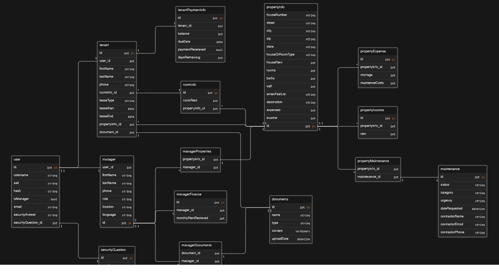

# PropTrac Backend

**Quick Links:**

 &ensp;  

## API

**Details:** API is deployed on Azure.

Base URL: https://proptracapi.azurewebsites.net

> [!IMPORTANT]
> Please view the tables below for specific endpoints/ requests. 

<h4 align="center">Table 1: User Controller Endpoints</h4>

| Description                              | HTTP Method | Endpoint                          | Parameter Type | Parameter Requirements |
| -------------                            | ----------- | -------------                     | -------------  | ------------- |
| Create an Account *(Manager or Tenant)*  | `POST`      | /User/AddUser                     | Body           | int ID, string Username, string Password, string Email, bool IsManager, string FirstName, string LastName, string SecurityAnswer, int SecurityQuestionID |
| Login *(Manager or Tenant)*              | `POST`      | /User/Login                       | Body           | string UsernameOrEmail, string Password |
| Get All User Info (Role)                 | `GET`       | /User/GetUserInfoByUsernameOrEmail/{usernameOrEmail}| URL            | string UsernameOrEmail |
| Update User                              | `PUT`       | /User/Update                      | Body           | .. |
| Delete User                              | `DELETE`    | /User/DeleteUser/{userToDelete}   | URL            | .. |
| Update Username                          | `PUT`       | /User/UpdateUser/{id}/{username}  | URL            | .. |

<h4 align="center">Table 2: Password Controller Endpoints</h4>

| Description                         | HTTP Method | Endpoint                                    | Parameter Type | Parameter Requirements |
| -------------                       | ----------- | -------------                               | -------------  | ------------- |
| Get List of all Security Questions  | `GET`       | /Password/SecurityQuestionList              | N/a            | None |
| Request Password Reset              | `POST`      | /Password/RequestReset                      | Body           | string UsernameOrEmail |
| Response for Reset                  | `POST`      | /Password/ResponseForReset                  | Body           | string UsernameOrEmail, string SecurityAnswer |
| Password Reset                      | `PUT`       | /Password/ResetPassword                     | Body           | string UsernameOrEmail, string SecurityAnswer, string NewPassword |

<h4 align="center">Table 3: Tenant Controller Endpoints</h4>

| Description                         | HTTP Method | Endpoint                                    | Parameter Type | Parameter Requirements |
| -------------                       | ----------- | -------------                               | -------------  | ------------- |
| Get All Tenant Dashboard Info       | `GET`       | /Tenant/GetTenantDashboardInfo/{userId}     | URL            | int userId |

<h4 align="center">Table 4: Manager Controller Endpoints</h4>

| Description                         | HTTP Method | Endpoint                                    | Parameter Type | Parameter Requirements |
| -------------                       | ----------- | -------------                               | -------------  | ------------- |
| Get Manager Dashboard Property Stats| `GET`       | /Manager/GetPropertyStatsByUserID/{userId}  | URL            | int userId    |
| Get Manager Dashboard Maintenance   | `GET`       |   | URL            | int userId    |

Tables 1, 2, 3, 4: API endpoints updated April 11, 2024

## Database

**Details:** Database is Azure SQL. (Basic Free Plan)

<h4 align="center">Entity Relationship Diagram</h4>

Figure 2: ERD illustrating database schema updated April 5, 2024

