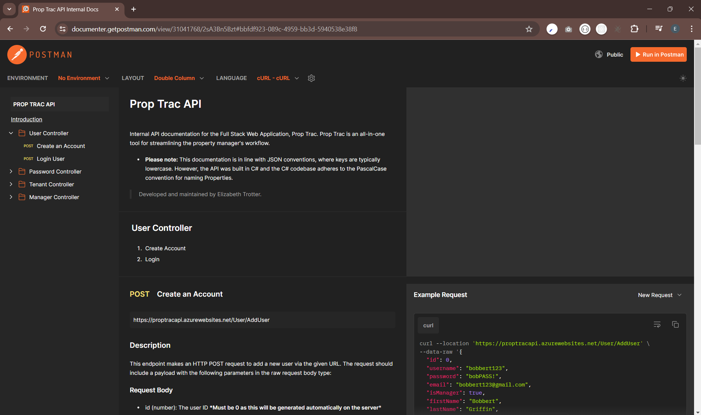
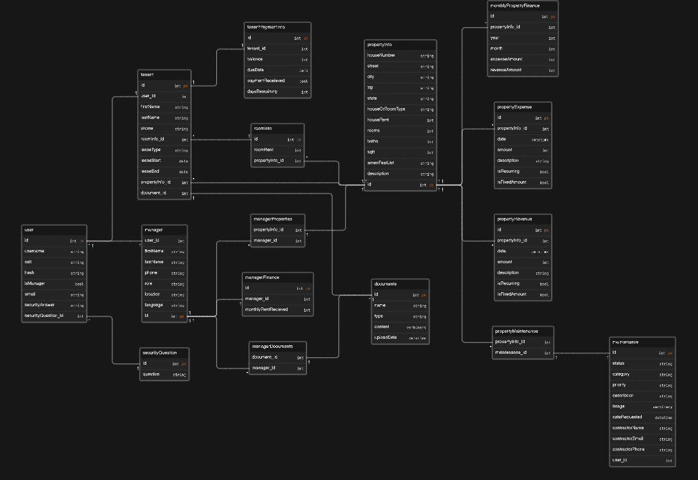

# PropTrac Backend

**Quick Links to Frontend:**

 &ensp; 

## API &ensp;

**Details:** Prop Trac's `API` was built in `C#` following the `Model-View-Controller` Architecture (MVC), and was deployed using `Azure App Services`.

Base URL: https://proptracapi.azurewebsites.net

> [!NOTE]
> Please view the documentation developed with `Postman` for specific endpoints/ requests. 
> - These endpoints were developed for the **internal team**.

Figure 1: Preview of published API Documentation for use with internal team, developed with Postman.

## Database &ensp;

**Details:** Database is hosted in `Azure SQL Cloud` alongside the C# MVC API on Azure.

<h4 align="center">Entity Relationship Diagram</h4>

Figure 2: Preview of ERD illustrating database schema version 2.4

